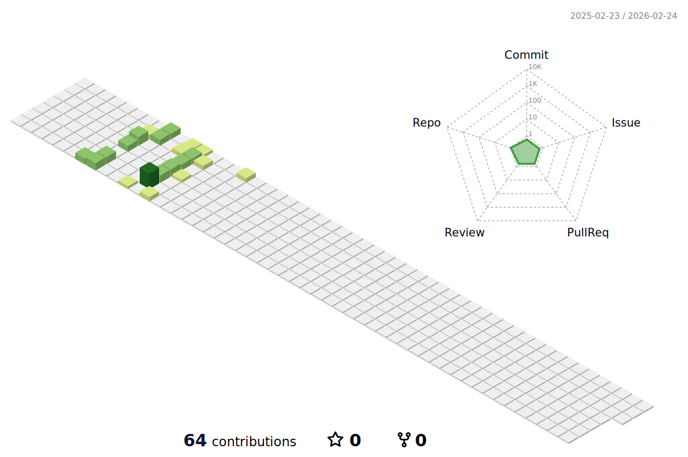

 👋 Hi, I’m @Rojahm
 

 👩‍💻 I work as I.T. admin in a small institute. Microsoft MCITP Style! I enjoy working but there is not much for me to learn here, so I'm trying to change.
  
 done with studying nodejs and working with expressjs, nextjs and redux projects
  
 👀 I’m interested in a great remote job, to spend more time with my cats and less time commuting! 
  
 💻 Interesed in linux and working to get my LPIC-1
  
 🌱 Finished learning practical coding(JS) at SheCodes Workshops, Thanks to SheCodes Foundation
  
 👊 Love the front-end and exploring react everyday. Since i have to really undrestand how things completely work I'm learning my way through Redux, Database structures, Nodejs and cloud microservices. I don't aim to do everything at once myself because that's what you do when you know how vastly detailed with tricks and practices every framework is. And i love to master the fabulous tricks of frameworks i work with after i'm sure i know how everything works in the whole development and production process.
  
 📫 My email: s.roja.h.m@gmail.com
  
 😻 I enjoy swimming, riding my bike
  
 🎹 Past years i've been practicing piano and learning music theory
  
 🎸 Hope to spend more time with the guitar and making music
   
 

